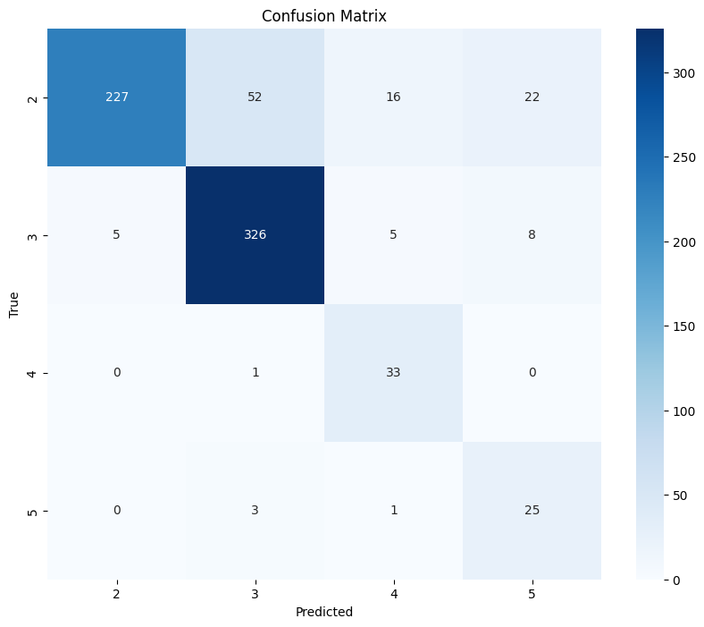
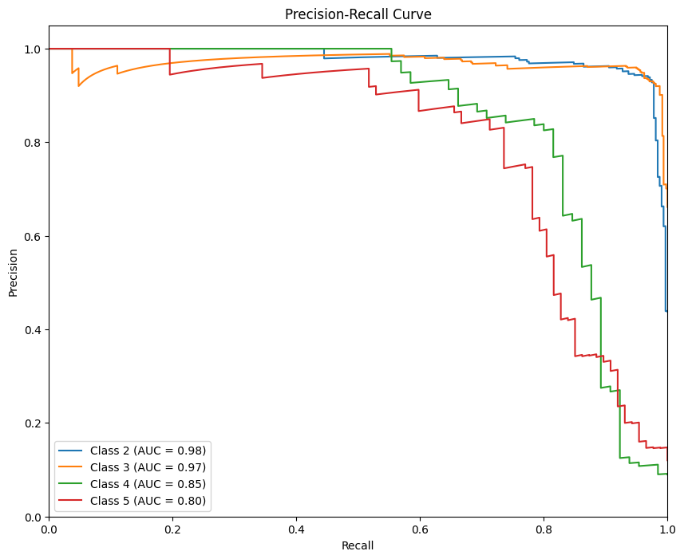
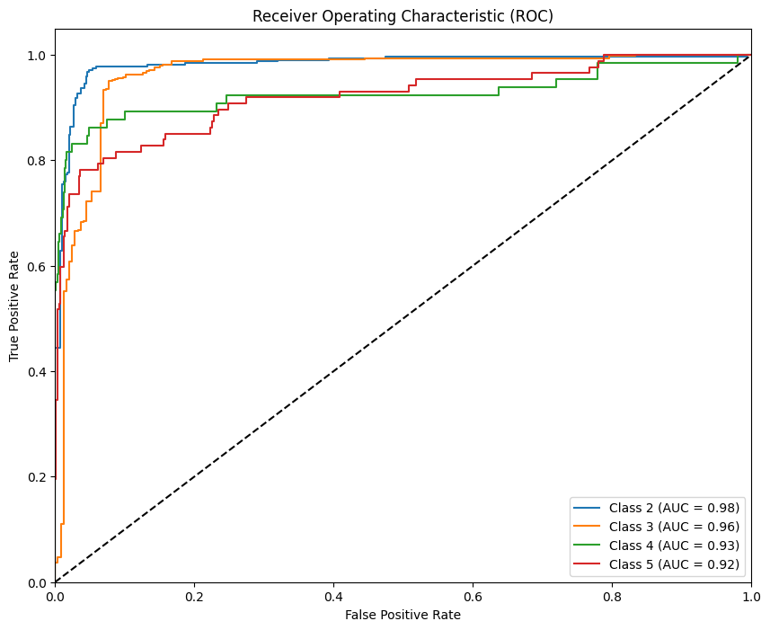
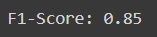

# Road Anomaly Detection (RAD)

## Project Description

This project involves the development and evaluation of a classification model for Road Anomaly Detection (RAD). The classes of interest in this project include:
- Road Damages (Potholes, Cracks, Protrusions, Manholes)
- Unsurfaced Roads (Untarred roads)
- Pedestrians (Pedestrians on the side of the road or crossing the road)
- Speed Bumps (Speed breakers and speed bumps)

## Model Description

The model is built using a pre-trained ResNet50 architecture, which is fine-tuned for our specific classification task. The model is trained using augmented image data to enhance its generalization capabilities.

### Key Components

- **ResNet50:** A deep residual network with 50 layers, pre-trained on ImageNet.
- **Data Augmentation:** Techniques such as rotation, width and height shifts, shear, zoom, and horizontal flip are used to augment the training data.
- **Callbacks:** Including early stopping and model checkpointing to save the best model and prevent overfitting.

## Dataset Description

The dataset consists of images categorized into the following classes:
- Road Damages (Potholes, Cracks, Protrusions, Manholes)
- Unsurfaced Roads (Untarred roads)
- Pedestrians (Pedestrians on the side of the road or crossing the road)
- Speed Bumps (Speed breakers and speed bumps)

Each image is pre-processed and augmented to ensure robust training. The dataset is split into training and validation sets.

## Results

